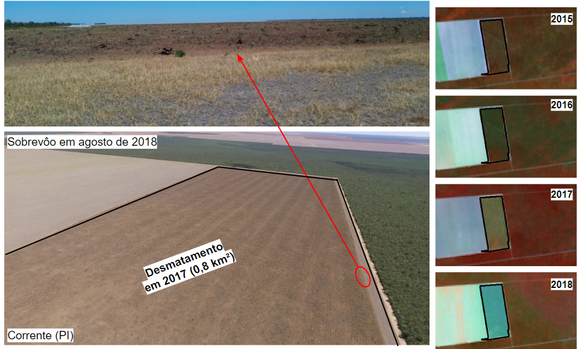
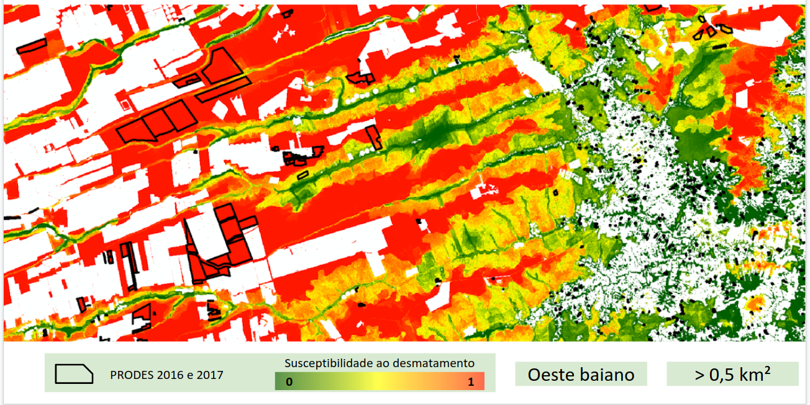

# Métricas de Qualidade

## Processos de validação

### Campo

Durante a vigência do projeto FIP Monitoramento foram realizadas [quatro atividades de campo](/04-metricas_de_avaliacao/#dados-de-campos). Essas atividades foram conduzidas com o propósito de coletar dados que pudesse subsidiar tanto o processo de validação dos produto PRODES-Cerrado e DETER-Cerrado, quanto a calibração dos critérios utilizados durante o processo de inspeção visual realizado no âmbito da validação amostral.

### Validação amostral
Uma [validação amostral](/04-metricas_de_avaliacao/#dados-de-validacao-amostral) foi realizada, a partir da interpretação visual em imagens de satélite, para o mapa PRODES-Cerrado com as classes referentes ao desmatamentos realizados até o ano de 2019. A análise do resultado deste processo proporcionou a publicação do artigo "*Quality assessment of the PRODES Cerrado deforestation data*" na revista acadêmica [Remote Sensing Applications: Society and Environment](https://www.journals.elsevier.com/remote-sensing-applications-society-and-environment). 

## Análises automáticas 

### Superfície de Susceptibilidade ao Desmatamento

Duas superfícies de susceptibilidade foram [criadas](/04-metricas_de_avaliacao/#construcao-das-superficies) com o propósito de espacializar as áreas com alto potencial para desmatamentos pequenos e grandes. Estes produtos foram obtidas a partir da compilação de 11 métricas espacialmente explicitas, a verificação dos respectivos pesos na ocorrência de eventos de supressão da vegetação nativa e a espacialização da probabilidade de ocorrência deste fenômeno.

O exemplo abaixo apresenta a superfície de susceptibilidade aos desmatamentos grandes no Oeste Baiano juntamente com os polígonos detectados pelo PRODES-Cerrado 2016 e 2017. Observa-se que diversos polígonos com áreas grandes se encontram na região com alta susceptibilidade a desmatamentos grandes, enquanto desmatamentos com pequenas áreas estão localizados em área menos susceptíveis a desmatamentos maiores que 0,5 km². Com isto, pode-se observar a boa aderência do modelo em relação aos dados do PRODES-Cerrado. Os detalhes da sua construção podem ser visualizados [aqui](/04-metricas_de_avaliacao/#construcao-das-superficies)

  

Publicações:  

 * [A deforestation probability surface in support of the vegetation monitoring in the Brazilian Cerrado biome](/pdfs/AGU_Nogueira_et_al.pdf)    
 * [Deforestation Polygon Assessment Tool: Providing comprehensive information on deforestation in the brazilian Cerrado biome](https://www.int-arch-photogramm-remote-sens-spatial-inf-sci.net/XLII-3-W12-2020/213/2020/isprs-archives-XLII-3-W12-2020-213-2020.pdf)  

### B-Fast Monitor

A quebra da tendência temporal, a partir de 2015, dos valores de NDVI referentes a cada pixel MODIS, com resolução espacial de 250 metros, presente nos polígonos detectados pelo PRODES-Cerrado, foi verificada pelo método B-Fast Monitor.

Após a sua execução, entre 2016 e 2018 (i.e. 525.038 pixels), foi observado que cerca de 82% dos polígonos apresentaram pixels com quebras em suas séries temporais, e dentre estes, polígonos com área de pelo menos 0,25 km² apresentaram mais de 50% dos pixels com quebras, um indicativo da eficiência deste método em detectar desmatamentos grandes. Em contrapartida, os polígonos que apresentaram até 25% de pixels com quebra representam cerca de 46% do total de polígonos do PRODES-Cerrado, porém este valor é equivalente a uma área total de 2.369 km², que representa apenas 11% do total desmatamento entre 2016 e 2018.

A figura acima apresenta um exemplo de polígono de desmatamento detectado pelo PRODES-Cerrado em 2017 e também confirmado automaticamente pelo Bfast-Monitor. Nela é possível observar um polígono com uma área total de 18 km² no município de Mateiros-TO, onde sua imagem MODIS apresenta 350 pixels sendo que 218 destes sofreram rupturas.

Por fim, é importante ressaltar que do total de 21.869 km² de áreas desmatadas entre 2016 e 2018 no bioma Cerrado, o Bfast-Monitor foi capaz de identificar 15.550 km² de polígonos que apresentaram pelo menos 50% de quebras em suas séries temporais, o que representa ~71% do total. Nas demais áreas também foram identificados pixels com quebras, porém em menor proporção, o que indica a presença de desmatamento de tamanho inferior a 0,25 km², o que devido a resolução do pixel MODIS se torna mais difícil de ser identificado. De forma geral, foi possível observar uma convergência entre os resultados gerados pelo Bfast-Monitor e os dados divulgados pelo PRODES-Cerrado.  

Publicações:  

 * [Assessing land-cover changes in the Brazilian Cerrado biome based on the time-series analysis of MODIS and Landsat datasets](/pdfs/AGU_Parente_et_al.pdf)  
 * [Deforestation Polygon Assessment Tool: Providing comprehensive information on deforestation in the Brazilian Cerrado biome](https://www.int-arch-photogramm-remote-sens-spatial-inf-sci.net/XLII-3-W12-2020/213/2020/isprs-archives-XLII-3-W12-2020-213-2020.pdf)  

