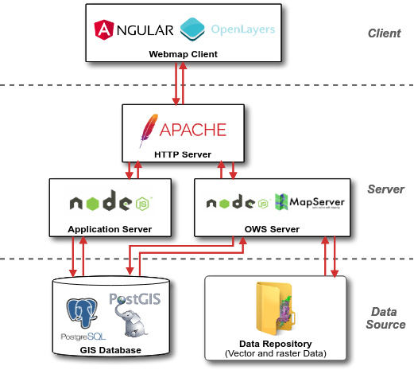

# Arquitetura de software
O Cerrado DPAT foi desenvolvido de acordo com os padrões de interoperabilidade definidos pela *Open Geospatial Consortium* ([OGC](https://www.ogc.org/)) e a arquitetura de *webservices* com o padrão [REST](https://pt.wikipedia.org/wiki/REST).

## Componentes de software
A arquitetura de software desenvolvida para o Cerrado DPAT pode ser observada na Figura abaixo.

Essencialmente, pode-se dividir o Cerrado DPAT em três partes:

+ *Client:* responsável por apresentar toda a interface, construído em Angular 8 com apoio dos frameworks:
    - WebMap: Mapa interativo construído com o [OpenLayers](https://openlayers.org/)
    - Componentes *front-end*: [Bootstrap 4](https://getbootstrap.com/), [Material](https://material.angular.io/) e [PrimeNG](https://www.primefaces.org/primeng/).
+ *Server:* Disponibiliza os serviços que compõem a aplicação:
    - *Application Server:* Disponibiliza o acesso aos dados do Data Source, análises e configurações.
    - *OWS Server*: Disponibiliza o acesso ao [MapServer](https://mapserver.org/), responsável pelo processamento dos dados geográficos, apresentação visual dos mesmos e gerenciamento de cache das imagens geradas.
+ *Data Source*: Responsável por armazenar os dados vetoriais e matriciais.

Resumidamente, todos os dados usados pelo Cerrado DPAT estão organizados em um banco de dados PostgreSQL e em sistemas de arquivos *(Data Repository)*. O PostgreSQL utiliza a extensão PostGIS que permite processar consultas espaciais via *Structured Query Language* (SQL). Já os dados que não necessitam de cruzamentos espaciais são armazenados em arquivos nos formatos Shapefile e/ou GeoTIFF.

Estes dados são acessados pelo *Application Server* e pelo *OWS Server* (ambos construídos em NodeJS) e são disponibilizados através de URLs com requisições por meio do protocolo [HTTP](https://pt.wikipedia.org/wiki/Hypertext_Transfer_Protocol). Todas as requisições Web realizadas aos Servers são interceptadas pelo Apache Server e devidamente redirecionadas. Desta forma, o *Client* realiza todas as requisições necessárias para construir a visualização dos elementos da página, tais como: mapa interativo, gráficos, campo de busca e etc.

Por fim, destaca-se que todo o código-fonte para o Cerrado DPAT e também para o OWS Server foi disponibilizado publicamente no [Github do LAPIG/UFG](https://github.com/lapig-ufg/d-pat).
