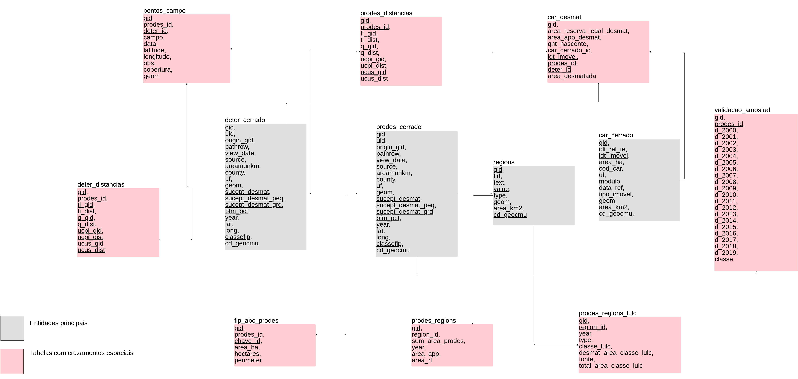

# Dados Vetoriais

No Cerrado DPAT todos os dados vetoriais estão armazenados em um banco de dados PostgreSQL. O último backup deste banco pode ser encontrado no [link](https://drive.google.com/file/d/19nVhry3bvHpV_oY861saBV9prXpfnFtd/view?usp=sharing) no arquivo `BKP_BANCO_DADOS_FIP_CERRADO.tar.gz`. 

## Banco de dados e MER

No modelo de entidade relacionamento (MER) do banco de dados, apresentado a seguir, as tabelas foram agrupadas em duas categorias:

* **Entidades Principais (cinza)**: estrutura responsável por armazenar os dados consolidados utilizados no Cerado DPAT, conforme foram disponibilizados pela sua instituição. O Cerrado DPAT conta com mais de 20 entidades, porém, em sua maioria são utilizados apenas como camadas de dados, sem realização de cruzamentos, portanto, as entidades utilizadas neste MER foram as utilizadas em diversos cruzamentos espaciais para análise.

* **Tabelas com cruzamentos espaciais**: estrutura responsável por armazenar resultados de cruzamentos espaciais entre diferentes entidades do Cerrado DPAT. Em sua maioria, os cruzamentos espaciais resultam em referências entre chaves únicas, além do resultado de algum tipo de processamento, como por exemplo, *area_desmat*, que representa a área desmatada (detectada pelo PRODES-Cerrado) em uma propriedade rural, que é armazenada pela tabela *car_desmat*.

 


### Principais entidades

#### prodes_cerrado e deter_cerrado

Entidades (tabelas) responsáveis por armazenar os polígonos PRODES-Cerrado e DETER-Cerrado consolidados que são apresentados no Cerrado DPAT. O identificador único **(gid)** destas tabelas são usadas em entidades auxiliares, tais como, **pontos_campo**, **validacao_amostral**, **car_desmat** e outras para identificar seu cruzamento com as mesmas, portanto, não se deve alterá-lo.

#### regions

Entidade responsável por armazenar todas as regiões (municípios e estados) do Cerrado. A coluna `value` apresenta o valor de identificação da região e `type` diferencia municípios (anotado como **city**) dos estados (anotado como **state**).

#### car_cerrado

Entidade responsável por armazenar os dados de cada propriedade rural presente no Cerrado. Cada propriedade possui um identificador único anotado pela variável `idt_imovel`. Este valor é utilizado para associar cada propriedade rural com a reserva legal (tabela `geo_car_reserva_legal_cerrado`), com áreas de preservação permanente (tabela `geo_car_app_cerrado`) e nascentes (tabela `geo_car_nascente_cerrado`).

## Processo de atualização

Diversos dados presentes na plataforma Cerrado DPAT são periodicamente atualizados pelas instituições competentes. Desta forma, a medida que os mesmos são atualizados e disponibilizados pelas instituições também é necessário realizar a atualização no banco de dados do Cerrado DPAT.

Os comandos a seguir foram todos desenvolvidos na linguagem `sql`, portanto podem ser executados em qualquer ambiente que realize a conexão com PostgreSQL, tais como o [pgAdmin](https://www.pgadmin.org/) ou o próprio ambiente nativo conhecido como `psql`. A fim de facilitar, pode-se criar um arquivo de extensão `.sql` e executá-lo da seguinte forma:

```
psql "dbname='<db_name>' user='<db_user>' password='<db_pwd>' host='<db_host'" -f <path_to_>/yourFileName.sql
```

### PRODES Cerrado

Devido a divulgação anual do PRODES-Cerrado é necessário realizar a sua atualização sempre que um novo produto é lançado. Desta forma, deve-se visitar o site do [Terrabrasilis](http://terrabrasilis.dpi.inpe.br/downloads/) para verificar se um novo PRODES-Cerrado foi lançado e realizar o seu download em Shapefile. 

A fim de demonstrar todos os procedimentos necessários após uma nova atualização do PRODES-Cerrado, iremos utilizar o mesmo processo realizado na atualização do PRODES-Cerrado 2019 executada em Janeiro de 2020. Na ocasião o INPE disponibilizou um Shapefile único para o PRODES-Cerrado 2019 com uma estrutura própria detalhada a seguir. Atualmente, pode-se encontrar todos os desmatamentos PRODES-Cerrado em um Shapefile único no [link](http://terrabrasilis.dpi.inpe.br/download/dataset/cerrado-prodes/vector/yearly_deforestation_2002_2019_cerrado_biome.zip). Porém é importante ressaltar que o padrão das colunas disponibilizados pelo INPE pode ser alterada em atualizações futuras.

Após download do shapefile único contendo os desmatamentos PRODES-Cerrado 2019, primeiramente é necessário importar os dados para o banco de dados, alterando corretamente os parâmetros <host_address> <db_user> <db_name> abaixo:

``` sh
shp2pgsql -s 4674 -W "UTF-8" ProdesCerrado_2019_incremento.shp public.prodes2019 | psql -h <host_address> -U <db_user> -d <db_name>
```

O comando acima importa os dados do Shapefile em uma tabela nomeada `prodes2019`. Na ocasião, o PRODES-Cerrado 2019 foi disponibilizado sem o campo de identificação em qual município aquele desmatamento ocorreu e com a coluna `state` que identificava os estados pelo nome por extenso. Portanto, inicialmente deve-se alterar o padrão dos estados para utilizar o campo *uf* com apenas 2 caracteres.

``` sql
ALTER TABLE prodes2019 
ADD COLUMN uf character varying(2);
```

Em seguida, preencha o campo `uf` com o seguinte comando:

``` sql
update prodes2019 
set uf = CASE
	when state = 'PARÁ' THEN 'PA'
	when state = 'MATO GROSSO' THEN 'MT'
	WHEN state = 'PIAUÍ' THEN 'PI'
	WHEN state = 'BAHIA' THEN 'BA'
	WHEN state = 'MARANHÃO' THEN 'MA'
	WHEN state = 'TOCANTINS' THEN 'TO'
	WHEN state = 'MATO GROSSO DO SUL' THEN 'MS'
	WHEN state = 'MINAS GERAIS' THEN 'MG'
	WHEN state = 'PARANÁ' THEN 'PR'
	WHEN state = 'RONDÔNIA' THEN 'RO'
	WHEN state = 'SÃO PAULO' THEN 'SP'
	WHEN state = 'DISTRITO FEDERAL' THEN 'DF'
	WHEN state = 'GOIÁS' THEN 'GO'
	ELSE '00'
END
```

Além dos estados, caso as novas atualizações não possuam a identificação do município, deve-se verificar se o mesmo polígono de desmatamento se encontra em mais de um município ao mesmo tempo, o que pode ser alcançado com a query abaixo. **Vale ressaltar que os passos descritos abaixo só devem ser executados caso o INPE não identifique o município onde ocorreu o desmatamento.**

``` sql
SELECT prodes.gid, count(city.*)
FROM prodes2019 prodes
inner join municipios_cerrado city on ST_INTERSECTS(city.geom, prodes.geom)
GROUP BY prodes.gid HAVING COUNT(city.*) > 1
```

Em seguida, deve-se copiar os polígonos PRODES-Cerrado 2019 para uma tabela alternativa `prodes2019_alt` (que possui o campo de município) dividindo o polígono nas porções que pertencem a cada município. Esta operação irá aumentar a quantidade de polígonos no banco, porém não irá impactar na área desmatada.

``` sql
ALTER TABLE prodes2019 
ADD COLUMN county character varying(60);
```

``` sql
insert into prodes2019_alt (id, state, path_row, class_name, image_date, year, area_km2, uf, county, geom)
select prodes.id, prodes.state, prodes.path_row, prodes.class_name, prodes.image_date, prodes.year, prodes.area_m2, prodes.uf, city.nm_municip, ST_Multi(ST_INTERSECTION(prodes.geom, city.geom)) from prodes2019 prodes 
inner join municipios_cerrado city on ST_INTERSECTS(prodes.geom, city.geom)
```

Além de criar o campo `county`, deve-se também já armazenar o valor da área do desmatamento de cada polígono na tabela `prodes2019_alt` já convertendo para km².

``` sql
update prodes2019_alt
set area_km2 = ST_AREA(geom::GEOGRAPHY) / 1000000.0
where year = 2019
```

Por fim, deve-se inserir os polígonos PRODES-Cerrado 2019 na tabela oficial onde estão todos os polígonos, incluindo a longitude e latitude do Centróide do polígono.

``` sql
insert into prodes_cerrado (uid, pathrow, view_date, source, areamunkm, uf, geom, year, classname, lat, long)
select id, path_row, image_date, 'inpe cerrado' , area_m2, uf, geom, year, class_name, st_y(ST_PointOnSurface(geom)), st_x(ST_PointOnSurface(geom)) from prodes2019_alt
```


### DETER Cerrado

Devido a constante revisão do DETER-Cerrado, onde polígonos de desmatamento são reanalisados e validados antes de sua consolidação no PRODES-Cerrado, ao atualizar este produto é necessário excluir todos os dados anteriores sobre ele e inserir o novo por completo. Para tal, o primeiro passo é excluir os registros na tabela `deter_cerrado`.

``` sql
ALTER TABLE "public"."pontos_campo" DROP CONSTRAINT "pontos_campo_deter_id_fkey";
TRUNCATE TABLE deter_cerrado RESTART IDENTITY;
ALTER TABLE "public"."pontos_campo" ADD CONSTRAINT "pontos_campo_deter_id_fkey" FOREIGN KEY (deter_id) REFERENCES deter_cerrado(gid);
```

Obs. Caso seja necessário desativar e reativar mais restrições (CONSTRAINTS), utilize a query abaixo para encontrar todas as restrições presentes no banco e em seguida a query seguinte para descobrir todas as queries de reconstrução das constraints.

``` sql
/*
DROP CONSTRAINTS SCRIPT
*/

 SELECT 'ALTER TABLE "'||nspname||'"."'||relname||'" DROP CONSTRAINT "'||conname||'";'
 FROM pg_constraint 
 INNER JOIN pg_class ON conrelid=pg_class.oid 
 INNER JOIN pg_namespace ON pg_namespace.oid=pg_class.relnamespace 
 ORDER BY CASE WHEN contype='f' THEN 0 ELSE 1 END,contype,nspname,relname,conname


/*
RECREATE CONSTRAINTS SCRIPT:
*/

SELECT 'ALTER TABLE "'||nspname||'"."'||relname||'" ADD CONSTRAINT "'||conname||'" '||
   pg_get_constraintdef(pg_constraint.oid)||';'
 FROM pg_constraint
 INNER JOIN pg_class ON conrelid=pg_class.oid
 INNER JOIN pg_namespace ON pg_namespace.oid=pg_class.relnamespace
 ORDER BY CASE WHEN contype='f' THEN 0 ELSE 1 END DESC,contype DESC,nspname DESC,relname DESC,conname DESC;


```

Em seguida, deve-se realizar o download do [Shapefile](http://terrabrasilis.dpi.inpe.br/geonetwork/srv/eng/catalog.search#/metadata/e6e15388-4ca9-49b9-aec9-03891339a35e) com todos os Avisos Deter-Cerrado e em seguida pode-se inserir o shape em uma tabela temporária no banco de dados, nomeada `deter_public`, através do comando:


``` sh
shp2pgsql -s 4674 -W "UTF-8" deter_public.shp public.deter_public | psql -h <host_address> -U <db_user> -d <db_name>
```

Com o shape carregado na tabela `deter_public` no banco de dados, basta popular a tabela `deter_cerrado` com o seguinte comando em SQL:

``` sql
insert into deter_cerrado (classname, path_row, view_date, sensor, satellite, areamunkm, county, uf, uc, geom)
select classname, path_row, view_date, sensor, satellite, areamunkm, municipali, uf, uc, geom from deter_public
```

Por fim, deve-se também atualizar a latitude e longitude do centróide do polígono DETER-Cerrado:

``` sql
update deter_cerrado
set lat = st_y(ST_PointOnSurface(geom)),
	long = st_x(ST_PointOnSurface(geom))
where lat is null and long is null;
```

Após a inserção dos pontos, deve-se excluir os polígonos que já foram antropizados e reconhecido pelo PRODES-Cerrado, utilizando a query abaixo:

``` sql
DELETE FROM deter_cerrado d
USING prodes_cerrado p 
WHERE ST_EQUALS(p.geom, d.geom);
```


### Cadastro Ambiental Rural (CAR)

Após a criação dos quatro shapefiles com os principais componentes do CAR (Propriedades Rurais, Reserva Legal, Área de Preservação Permanence e Nascentes) deve-se inserir corretamente estes dados no banco de dados.

``` sh
shp2pgsql -s 4674 -W "UTF-8" car.shp public.car_cerrado_temp | psql -h <host_address> -U <db_user> -d <db_name>
```

### Cruzamentos espaciais entre os dados

#### PRODES e DETER-Cerrado com o CAR

Após realizar a atualização dos dados PRODES-Cerrado, DETER-Cerrado e do CAR é necessário realizar os cruzamentos espaciais entre estes dados. Portanto, primeiramente é importante apagar os registros anteriores. Inicialmente iremos apagar a tabela de relacionamento entre os dados do CAR e os polígonos PRODES e DETER-Cerrado.

``` sql
TRUNCATE TABLE car_desmat RESTART IDENTITY;
```

Em seguida, inicialmente deve-se inserir (em relação de 1:1) o cruzamento entre as propriedades do CAR e os polígonos PRODES-Cerrado na tabela `car_desmat`:

``` sql
insert into car_desmat (car_cerrado_id, idt_imovel, prodes_id)
select car.gid, car.idt_imovel, prodes.gid from car_cerrado car 
inner join prodes_cerrado prodes on ST_INTERSECTS(car.geom, prodes.geom) where prodes.year >= 2013
```

Após o PRODES-Cerrado, insere-se os cruzamentos com o DETER-Cerrado:

``` sql
insert into car_desmat (car_cerrado_id, idt_imovel, deter_id)
select car.gid, car.idt_imovel, prodes.gid from car_cerrado car 
inner join deter_cerrado deter on ST_INTERSECTS(car.geom, deter.geom)
```

Com as relações criadas, atualiza-se a tabela `car_desmat` com a quantidade de nascentes e cada desmatamento detectado dentro de uma propriedade rural:

``` sql
update car_desmat
set qnt_nascente = sub.qnt 
from 
    (
      select c.car_cerrado_id as internocar, c.prodes_id as internoprodes, count(rl.gid) as qnt
      from geo_car_nascente_cerrado rl
      inner join car_desmat c on c.idt_imovel = rl.idt_imovel 
      group by 1,2
     ) as sub 
where sub.internocar = car_desmat.car_cerrado_id and sub.internoprodes = car_desmat.prodes_id
```

#### PRODES e DETER-Cerrado com o CAR

Após realizar a atualização dos dados PRODES-Cerrado e DETER-Cerrado é necessário realizar os cruzamentos espaciais entre estes dados e as áreas tratadas como Especiais pelo Cerrado DPAT, tais como:

+ *Terras Indígenas (TI).*
+ *Comunidades Quilombolas (AQ).*
+ *Unidades de Conservação de Uso Sustentável (UCUS).* 
+ *Unidades de Conversavação de Proteção Integral (UCPI).*

O tipo de cruzamento a ser realizado é o cálculo das distâncias entre cada polígono PRODES e/ou DETER e cada área especial, no intuito de descobrir a área mais próxima de cada polígono.

Portanto, primeiramente é importante apagar os registros anteriores. Inicialmente iremos apagar a tabela de relacionamento entre os dados do PRODES/DETER e as áreas especiais. A fim de facilitar, iremos utilizar ``*{origin_table}*'' para identificar a tabela de origem, seja ela PRODES ou DETER-Cerrado.
``` sql
TRUNCATE TABLE {origin_table}_distancias RESTART IDENTITY;
```

Em seguida, inicialmente deve-se inserir (em relação de 1:1) o cruzamento entre a área especial de TI e os polígonos {origin-table}-Cerrado na tabela `{origin_table}_distancias`:

``` sql
insert into {origin_table}_distancias ({origin_table}_id, ti_gid, ti_dist)
select 
a.gid as {origin_table}_id, b.gid as ti_gid, b.distance as distance
from {origin_table}_cerrado a 
cross join lateral
	(select b.gid, 
	-- (a.geom::geography <-> b.geom::geography)/1000.0 as distance 
	 CAST(ST_DistanceSphere(a.geom, b.geom)/1000.0 as numeric) as distance
	from areas_quilombolas b 
	--where st_dwithin(a.geom,b.geom,400) -- caso queira filtrar por distância mínima
	order by distance asc limit 1
	) as b
```

Em seguida, atualiza-se os demais campos referentes a Comunidades Quilombola (colunas q_gid, q_dist em deter_distancias e tabela 'areas_quilombolas'), UCUS (colunas ucus_gid, ucus_dist em deter_distancias e tabela 'ucs_uso_sustentavel') e UCPI (colunas ucpi_gid, ucpi_dist em deter_distancias e tabela 'ucs_protecao_integral') na tabela de relacionamento:

``` sql
update deter_distancias 
set q_gid = b.gid,
q_dist = b.distance
from deter_cerrado a
cross join lateral
	(select b.gid, 
	-- (a.geom::geography <-> b.geom::geography)/1000.0 as distance 
	 CAST(ST_DistanceSphere(a.geom, b.geom)/1000.0 as numeric) as distance
	from areas_quilombolas b 
	--where st_dwithin(a.geom,b.geom,400) -- caso queira filtrar por distância mínima
	order by distance asc limit 1
	) as b
where deter_distancias.deter_id = a.gid 
```


#### PRODES-Cerrado com os pontos da Validação de Campo

Após atualização dos dado PRODES-Cerrado, é necessária a atualização da referência ao polígono PRODES-Cerrado em relação aos pontos visitados durante a validação de campo. Para tal, executasse a seguinte query:

``` sql
UPDATE pontos_campo
set prodes_id = p.gid
from prodes_cerrado p
where pontos_campo.prodes_id is null and ST_INTERSECTS(p.geom, pontos_campo.geom)
```

Em seguida, realiza-se o mesmo processo em relação aos polígonos DETER-Cerrado:

``` sql
UPDATE pontos_campo
set deter_id = d.gid
from deter_cerrado d
where pontos_campo.deter_id is null and ST_INTERSECTS(d.geom, pontos_campo.geom)
```


#### PRODES-Cerrado com os pontos da Validação Amostral

Após atualização dos dado PRODES-Cerrado, é necessária a atualização da referência ao polígono PRODES-Cerrado em relação aos pontos inspecionados durante a validação amostral. Para tal, executasse a seguinte query:

``` sql
UPDATE validacao_amostral
set prodes_id = p.gid
from prodes_cerrado p
where validacao_amostral.prodes_id is null and ST_INTERSECTS(p.geom, validacao_amostral.geom)
```

#### PRODES-Cerrado acumulado em todas regiões (Municípios e Estados)

Após a atualização do PRODES-Cerrado, também é necessário o cálculo do desmatamento acumulado por município e também por estado. Para tal, deve-se inicialmente popular a tabela `prodes_regions` que irá armazenar o `id` da região (município ou estado) e a sua área desmatada. Note que deve-se atualizar a referêcia `where p.year = 2019` para o ano do desmatamento inserido no banco. Portanto, pode-se utilizar a seguinte query:

``` sql
/* Inserir desmatamento acumulado por estado */
insert into prodes_regions (region_id, sum_area_prodes, year)
select r.gid, sum(p.areamunkm), p.year from regions r inner join prodes_cerrado p on p.uf = r.value where p.year = 2019 and r.type = 'state' group by 1, 3

/* Inserir desmatamento acumulado por município */
insert into prodes_regions (region_id, sum_area_prodes, year)
select r.gid, sum(p.areamunkm), p.year from regions r inner join prodes_cerrado p on p.cd_geocmu = r.cd_geocmu where p.year = 2019 and r.type = 'city' group by 1, 3
```

Em seguida, deve-se atualizar os elementos recém inseridos na tabela `prodes_regions` com a área desmatada dentro de APPs e Reservas Legais:

``` sql
/* Atualização para desmatameto acumulado em APP e RL por estado */

/* APP */
update prodes_regions
set area_app = internal.area_desmat
from 
(SELECT sum(st_area(safe_intersection(p.geom, lc.geom)::geography) / 1000000.0::double precision) as area_desmat, r.gid as internoregion, p.year as internoyear
from prodes_cerrado p 
inner join geo_car_app_cerrado lc on lc.uf = p.uf
inner join regions r on r.value = lc.uf where ST_INTERSECTS(p.geom, lc.geom) and r.type = 'state' and p.year = 2019 group by 2,3)  as internal
where prodes_regions.region_id = internal.internoregion AND prodes_regions.year = internal.internoyear and internal.internoyear = 2019

/* RL */
update prodes_regions
set area_rl = internal.area_desmat
from 
(SELECT sum(st_area(safe_intersection(p.geom, lc.geom)::geography) / 1000000.0::double precision) as area_desmat, r.gid as internoregion, p.year as internoyear
from prodes_cerrado p 
inner join geo_car_reserva_legal_cerrado lc on lc.uf = p.uf
inner join regions r on r.value = lc.uf where ST_INTERSECTS(p.geom, lc.geom) and r.type = 'state' and p.year = 2019 group by 2,3)  as internal
where prodes_regions.region_id = internal.internoregion AND prodes_regions.year = internal.internoyear and internal.internoyear = 2019

/* Atualização para desmatameto acumulado em APP e RL por município */

/* APP */
update prodes_regions
set area_app = internal.area_desmat
from 
(SELECT sum(st_area(safe_intersection(p.geom, lc.geom)::geography) / 1000000.0::double precision) as area_desmat, r.gid as internoregion, p.year as internoyear
from prodes_cerrado p 
inner join geo_car_app_cerrado lc on lc.cd_geocmu = p.cd_geocmu
inner join regions r on r.cd_geocmu = lc.cd_geocmu where ST_INTERSECTS(p.geom, lc.geom) and r.type = 'city' and p.year = 2019 group by 2,3)  as internal
where prodes_regions.region_id = internal.internoregion AND prodes_regions.year = internal.internoyear and internal.internoyear = 2019

/* RL */
update prodes_regions
set area_rl = internal.area_desmat
from 
(SELECT sum(st_area(safe_intersection(p.geom, lc.geom)::geography) / 1000000.0::double precision) as area_desmat, r.gid as internoregion, p.year as internoyear
from prodes_cerrado p 
inner join geo_car_reserva_legal_cerrado lc on lc.cd_geocmu = p.cd_geocmu
inner join regions r on r.cd_geocmu = lc.cd_geocmu where ST_INTERSECTS(p.geom, lc.geom) and r.type = 'city' and p.year = 2019 group by 2,3)  as internal
where prodes_regions.region_id = internal.internoregion AND prodes_regions.year = internal.internoyear and internal.internoyear = 2019

```


#### PRODES-Cerrado com todas regiões (Municípios e Estados) em relação ao uso do solo

Após atualização do PRODES-Cerrado, também é necessário o cálculo da proporção de desmatamento em cada tipo de uso do solo para os polígonos recém inseridos no banco de dados. Desta forma, para calcular e inserir no banco esta informação para estados e municípios respectivamente deve-se executar as seguintes queries. Após as queries de inserção dos dados, é necessário ajustar a coluna `total_area_classe_lulc` da tabela `prodes_regions_lulc`, que representa o total da área de cada classe de uso solo dos mapas.

    Terraclass

``` sql
insert into prodes_regions_lulc (region_id, year, type, classe_lulc, color, desmat_area_classe_lulc, fonte)
select r.gid, p.year, 'state', lc.classe, g.color,
	sum(st_area(safe_intersection(p.geom, lc.geom)::geography) / 1000000.0::double precision), 'terraclass'
from regions r
inner join uso_solo_terraclass lc on r.value = lc.uf
inner join prodes_cerrado p on r.value = p.uf
INNER JOIN graphic_colors g on unaccent(g.name) ilike unaccent(lc.classe) AND g.table_rel = 'uso_solo_terraclass'
	where r.type = 'state' and ST_INTERSECTS(p.geom, lc.geom) and p.year = 2019 group by 1,2,3,4,5;
```

``` sql
insert into prodes_regions_lulc (region_id, year, type, classe_lulc, color, desmat_area_classe_lulc, fonte)
select r.gid, p.year, 'city', lc.classe, g.color,
	sum(st_area(safe_intersection(p.geom, lc.geom)::geography) / 1000000.0::double precision), 'terraclass'
from regions r
inner join uso_solo_probio lc on r.cd_geocmu = lc.cd_geocmu
inner join prodes_cerrado p on r.cd_geocmu = p.cd_geocmu
INNER JOIN graphic_colors g on unaccent(g.name) ilike unaccent(lc.classe) AND g.table_rel = 'uso_solo_terraclass'
	where r.type = 'city' and ST_INTERSECTS(p.geom, lc.geom) and p.year > 2000 and p.year < 2012 group by 1,2,3,4,5;
```

``` sql
/* Atualização do campo `total_area_classe_lulc` */

/* Por Município */
update prodes_regions_lulc
set total_area_classe_lulc = internal.total_area_lulc
from
(select r.gid as id, lc.cd_geocmu as code, lc.classe as classeInt,  sum(st_area(lc.geom,true)/1000000.0::double precision) as total_area_lulc from uso_solo_terraclass lc
inner join regions r on lc.cd_geocmu = r.cd_geocmu where lc.bioma='CERRADO' group by 1,2,3) as internal
where prodes_regions_lulc = 'city' and prodes_regions_lulc.region_id = internal.id and prodes_regions_lulc.classe_lulc = internal.classeInt

/* Por Estado */
update prodes_regions_lulc
set total_area_classe_lulc = internal.total_area_lulc
from
(select r.gid as id, r.value as code, lc.classe as classeInt,  sum(st_area(lc.geom,true)/1000000.0::double precision) as total_area_lulc from uso_solo_terraclass lc
inner join regions r on lc.uf = r.value where r.type = 'state' AND lc.bioma='CERRADO' group by 1,2,3) as internal
where prodes_regions_lulc = 'state' and prodes_regions_lulc.region_id = internal.id and prodes_regions_lulc.classe_lulc = internal.classeInt
```

    PROBIO

``` sql
insert into prodes_regions_lulc (region_id, year, type, classe_lulc, color, desmat_area_classe_lulc, fonte)
select r.gid, p.year, 'state', lc.classe, g.color,
	sum(st_area(safe_intersection(p.geom, lc.geom)::geography) / 1000000.0::double precision), 'probio'
from regions r
inner join uso_solo_probio lc on r.value = lc.uf
inner join prodes_cerrado p on r.value = p.uf
INNER JOIN graphic_colors g on unaccent(g.name) ilike unaccent(lc.classe) AND g.table_rel = 'uso_solo_probio'
where r.type = 'state' and ST_INTERSECTS(p.geom, lc.geom) and p.year > 2000 and p.year < 2013 group by 1,2,3,4,5;
```

``` sql
insert into prodes_regions_lulc (region_id, year, type, classe_lulc, color, desmat_area_classe_lulc, fonte)
select r.gid, p.year, 'city', lc.classe, g.color,
	sum(st_area(safe_intersection(p.geom, lc.geom)::geography) / 1000000.0::double precision), 'probio'
from regions r
inner join uso_solo_probio lc on r.cd_geocmu = lc.cd_geocmu
inner join prodes_cerrado p on r.cd_geocmu = p.cd_geocmu
INNER JOIN graphic_colors g on unaccent(g.name) ilike unaccent(lc.classe) AND g.table_rel = 'uso_solo_probio'
	where r.type = 'city' and ST_INTERSECTS(p.geom, lc.geom) and p.year > 2000 and p.year < 2012 group by 1,2,3,4,5;
```

``` sql
/* Atualização do campo `total_area_classe_lulc` */

/* Por Município */
update prodes_regions_lulc
set total_area_classe_lulc = internal.total_area_lulc
from
(select r.gid as id, lc.cd_geocmu as code, lc.classe as classeInt,  sum(st_area(lc.geom,true)/1000000.0::double precision) as total_area_lulc from uso_solo_probio lc
inner join regions r on lc.cd_geocmu = r.cd_geocmu where lc.bioma='CERRADO' group by 1,2,3) as internal
where prodes_regions_lulc = 'city' and prodes_regions_lulc.region_id = internal.id and prodes_regions_lulc.classe_lulc = internal.classeInt

/* Por Estado */
update prodes_regions_lulc
set total_area_classe_lulc = internal.total_area_lulc
from
(select r.gid as id, r.value as code, lc.classe as classeInt,  sum(st_area(lc.geom,true)/1000000.0::double precision) as total_area_lulc from uso_solo_probio lc
inner join regions r on lc.uf = r.value where r.type = 'state' AND lc.bioma='CERRADO' group by 1,2,3) as internal
where prodes_regions_lulc = 'state' and prodes_regions_lulc.region_id = internal.id and prodes_regions_lulc.classe_lulc = internal.classeInt
```

    Agrosatélite

``` sql
insert into prodes_regions_lulc (region_id, year, type, classe_lulc, color, desmat_area_classe_lulc, fonte)
select r.gid, p.year, 'state', lc.classe, g.color,
	sum(st_area(safe_intersection(p.geom, lc.geom)::geography) / 1000000.0::double precision), 'agrosatelite'
from regions r
inner join agricultura_agrosatelite lc on r.value = lc.uf
inner join prodes_cerrado p on r.value = p.uf
INNER JOIN graphic_colors g on unaccent(g.name) ilike unaccent(lc.classe) AND g.table_rel = 'agricultura_agrosatelite'
	where r.type = 'state' and ST_INTERSECTS(p.geom, lc.geom) and p.year = 2019 group by 1,2,3,4,5;
```

``` sql
insert into prodes_regions_lulc (region_id, year, type, classe_lulc, color, desmat_area_classe_lulc, fonte)
select r.gid, p.year, 'city', lc.classe, g.color,
	sum(st_area(safe_intersection(p.geom, lc.geom)::geography) / 1000000.0::double precision), 'agrosatelite'
from regions r
inner join agricultura_agrosatelite lc on r.cd_geocmu = lc.cd_geocmu
inner join prodes_cerrado p on r.cd_geocmu = p.cd_geocmu
INNER JOIN graphic_colors g on unaccent(g.name) ilike unaccent(lc.classe) AND g.table_rel = 'agricultura_agrosatelite'
	where r.type = 'city'  and ST_INTERSECTS(p.geom, lc.geom) and p.year = 2019 group by 1,2,3,4,5;
```

``` sql
/* Atualização do campo `total_area_classe_lulc` */

/* Por Município */
update prodes_regions_lulc
set total_area_classe_lulc = internal.total_area_lulc
from
(select r.gid as id, lc.cd_geocmu as code, lc.classe as classeInt,  sum(st_area(lc.geom,true)/1000000.0::double precision) as total_area_lulc from agricultura_agrosatelite lc
inner join regions r on lc.cd_geocmu = r.cd_geocmu where lc.bioma='CERRADO' group by 1,2,3) as internal
where prodes_regions_lulc = 'city' and prodes_regions_lulc.region_id = internal.id and prodes_regions_lulc.classe_lulc = internal.classeInt

/* Por Estado */
update prodes_regions_lulc
set total_area_classe_lulc = internal.total_area_lulc
from
(select r.gid as id, r.value as code, lc.classe as classeInt,  sum(st_area(lc.geom,true)/1000000.0::double precision) as total_area_lulc from agricultura_agrosatelite lc
inner join regions r on lc.uf = r.value where r.type = 'state' AND lc.bioma='CERRADO' group by 1,2,3) as internal
where prodes_regions_lulc = 'state' and prodes_regions_lulc.region_id = internal.id and prodes_regions_lulc.classe_lulc = internal.classeInt
```

