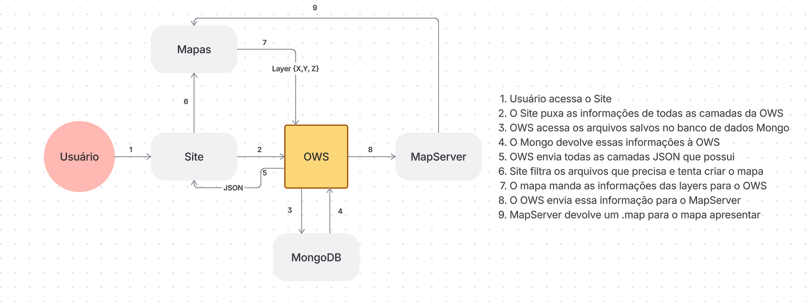

# OWS - OGC Web Services & Gerenciamento de Camadas

Documentação técnica do fluxo de renderização de mapas, arquitetura de serviços e procedimentos para atualização/adição de camadas do OWS.

---

## 1. Acesso ao Servidor (SSH)

Para atualizar, adicionar ou dar manutenção nas camadas do OWS, utilize a extensão **Remote - SSH** do VSCode.

### Passos de Conexão e Navegação:
1. Conecte à Máquina Virtual (`VM1`).
   * **Host / IP:** `<PREENCHER_IP_DA_VM1>`
   * **Usuário:** `<PREENCHER_USUARIO>`
   * Use da **Senha** para acessar a VM1
   
   Quando conectado, fica disponível o acesso ao banco do MongoDB onde é possível localizar os arquivos da ows.

---

## 2. Gerenciamento no MongoDB

Utilize a extensão **MongoDB for VSCode** conectada via IP.

* **String de Conexão / IP:** `mongodb:<IP_DO_MONGO>:<PORTA>/`

### 2.1. Edição de Camadas
* **Caminho:** Banco/Pasta `OWS` ➔ `layers` ➔ Coleção/Documento `documents`
* Aqui ficam cadastradas as definições de cada camada do OWS.

### 2.2. Atualização de Idiomas (Obrigatório)
> **CRÍTICO:** Toda alteração ou adição de camada **deve obrigatoriamente** ser refletida nos arquivos de idiomas. Caso contrário, ocorrerão falhas no carregamento de todas as aplicações dependentes.

* **Caminho:** Banco/Pasta `OWS` ➔ `languages` ➔ Coleção/Documento `documents`
* **Arquivos a alterar:**
  * `ows.languages:pt` (Português)
  * `ows.languages:en` (Inglês)

---

## 3. Gerenciamento de Arquivos MapServer (MinIO)

Os arquivos de configuração cartográfica `.map` ficam armazenados no **MinIO**.

* [URL do MinIO](https://minio.lapig.iesa.ufg.br)
* **Mapeamento de Pastas:** O caminho dentro do MinIO é idêntico ao do container `prod_ows.api_server`.
  * **Exemplo de caminho:** `STORAGE/catalog/<NOME_DA_CAMADA>` (ex: `STORAGE/catalog/araticum$`)

### Procedimento de Atualização:
1. Acesse a interface web do MinIO e navegue até a pasta correspondente.
2. Faça o upload, alteração ou download dos arquivos `.map`.
3. **Reiniciar o Container do OWS:** Para que o OWS baixe as atualizações do MinIO e aplique as mudanças, reinicie o container:
