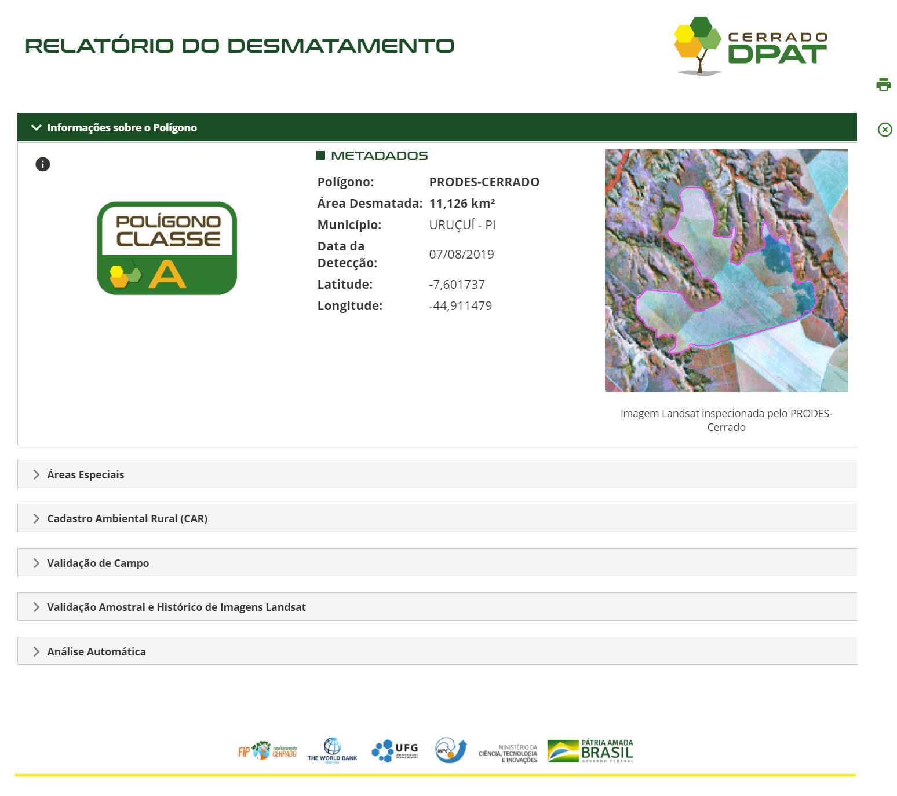
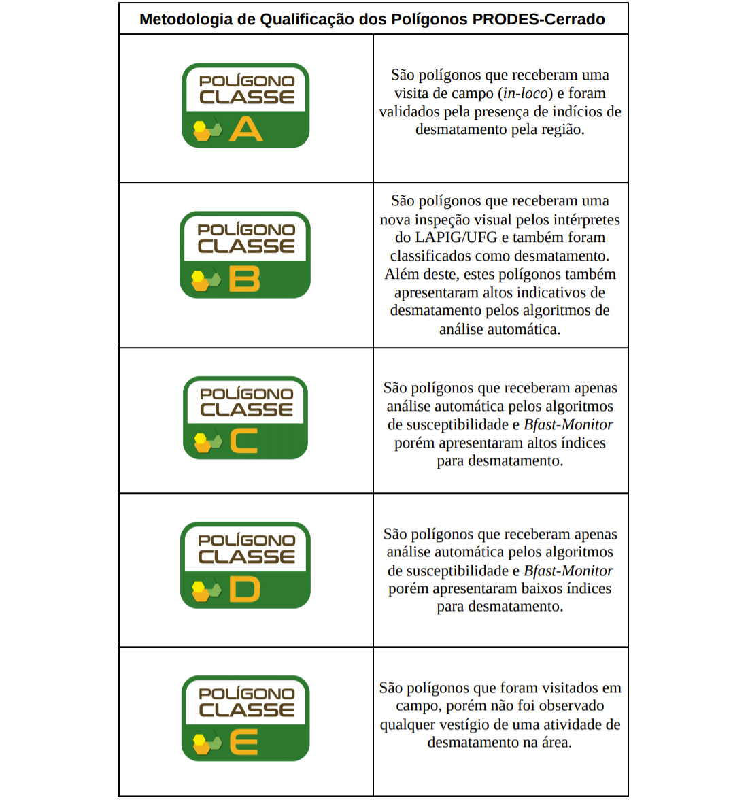

# Relatórios

## Relatório do estado/municipio

O Cerrado DPAT permite a visualização de estatísticas e camadas para cada um dos estados e 1.386 municípios do bioma Cerrado. Estes municípios podem ser selecionados por meio de uma busca rápida localizada na “Camada de Dados”. Assim, um zoom é aplicado para a área de interesse, junto com estatísticas referentes à série histórica dos dados PRODES-Cerrado, uso e cobertura do solo no ano de 2013 (dados Terraclass Cerrado), e área agrícola mapeada durante a safra 2013/14 (dados Agrosatélite). Além dos dados previamente carregados, destaca-se também a possibilidade da ativação de todas as camadas de dados (e.g., declividade, solos, susceptibilidade ao desmatamento, precipitação, unidades de conservação, terras indígenas, terras quilombolas, dados do CAR, florestas plantadas, silos e armazéns, rodovias e frigoríficos pertencentes ao sistema de inspeção federal).

## Relatório do polígono

Com o propósito de contextualizar cada área desmatada pelo PRODES-Cerrado, também apresentamos um relatório individual para cada polígono detectado. Este relatório apresenta seis seções: Informações Sobre o Polígono, Áreas Especiais, Cadastro Ambiental Rural (CAR), Validação de Campo, Validação Amostral e Histórico de Imagens Landsat, e, Análise Automática.

A primeira seção apresenta os dados disponibilizados pelo INPE para cada detecção: sistema (PRODES-Cerrado ou DETER-Cerrado), área desmatada (em km²), município, estado, data de detecção, latitude, longitude além dos limites do desmatamentos sobre a imagem inspecionada pelo INPE para a sua respectiva detecção. Nesta mesma seção é informado a classe atribuída ao polígono (A, B, C, D ou E).

A seção “Áreas Especiais” apresenta a distância do polígono em relação à Terra Indígena, Unidade de Conservação (Uso Sustentável e Proteção Integral) e Área Quilombola mais próxima. No caso de intersecção com alguma destas áreas, ou se a área estiver dentro de uma distância de 10 km, a localização do polígono é mostrada em conjunto com os respectivos limites da área especial em questão.

As intersecções do polígono desmatado com os dados do CAR (limite da propriedade, APP, Reserva Legal e Nascentes), assim como as áreas (km²) de cada uma destas intersecções, são apresentadas na seção “Cadastro Ambiental Rural (CAR)”.

 

Os dados coletados nas atividades de campo realizadas no âmbito do projeto FIP Monitoramento são disponibilizadas ao público por meio da seção “Validação de Campo”. Nela são apresentadas tanto fotos registradas em solo, quanto fotos e vídeos aéreos registrados por drones.

Na seção “Validação Amostral e Histórico de Imagens Landsat”, o usuário da plataforma tem acesso às imagens inspecionadas para a detecção dos desmatamentos no âmbito do sistema PRODES-Cerrado. Também são disponibilizados os pontos visualmente inspecionados no âmbito da validação amostral realizada pelo Laboratório de Processamento de Imagens e Geoprocessamento (Lapig) da Universidade Federal de Goiás (UFG).

As composições adotadas para os sensores Landsat TM (R4 G5 B3) e Landsat OLI (R5 G6 4B) realçam, em vermelho, a vegetação fotossinteticamente ativa. Os tons esverdeados correspondem tanto a áreas com vegetação esparsa e  baixo porte (textura heterogênea) quanto solo exposto (textura homogênea). Cicatrizes de queimadas são observadas na cor azul escuro, solos expostos podem ser observados na cor azul clara, e palhada de agricultura, em tonalidades esbranquiçadas.

Após a visualização da série histórica de imagens Landsat, uma série temporal obtida pelo sensor MODIS a partir de valores mensais do índice de vegetação Normalized Difference Vegetation Index (NDVI), também permite uma melhor compreensão sazonal do comportamento da vegetação desmatada.

Por fim, uma análise automática é aplicada a todos os polígonos de desmatamento  identificados. Ela se constitui de contextualizações geográficas e espectro temporais, respectivamente representadas pela superfície de susceptibilidade ao desmatamento (desmatamentos grandes e pequenos) e pelo resultado do uso do algoritmo B-Fast Monitor (utilizada para a detecção de quebras de tendências em séries temporais) em séries MODIS.

## Relatório da área submetida

Após o envio do arquivo espacializado, o usuário tem a opção de analisar a área submetida com um clique sobre o botão “Analisar”. Essa análise permite a visualização de um relatório com a área total, os municípios, e os estados que cruzam com a área submetida. Também são expostas as áreas totais anuais dos avisos provenientes do DETER-Cerrado e dos desmatamentos detectados pelo PRODES-Cerrado.

Observa-se na figura abaixo a sobreposição de desmatamentos (contorno em rosa) com uma Área Prioritária Para Conservação da Biodiversidade (Entorno da Terra Indigena Xerente) de Importância Biológica “Extremamente Alta” e Prioridade de Ação “Extremamente Alta”. Também é possível identificar, em vermelho, as áreas nativas mais susceptíveis ao desmatamento.

Destaca-se também a funcionalidade de visualização dos registros CAR referentes aos 50 maiores desmatamentos detectados dentro da área submetida. Além do código da respectiva propriedade, também são disponibilizados dados de área desmatada por CAR (km²), área de reserva legal total da propriedade (km²), área desmatada em reserva legal (km²), área total de APP da propriedade (km²) e área desmatada em APP da propriedade (km²).

