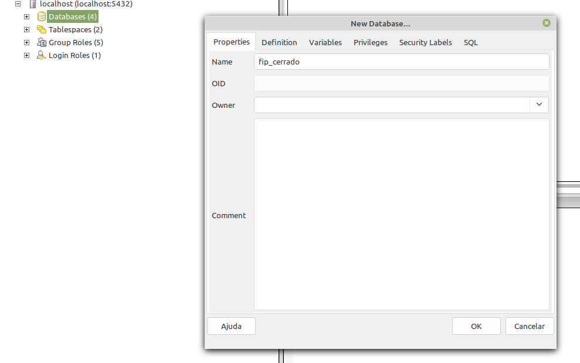
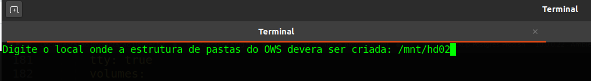
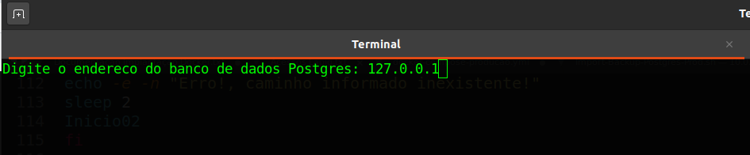
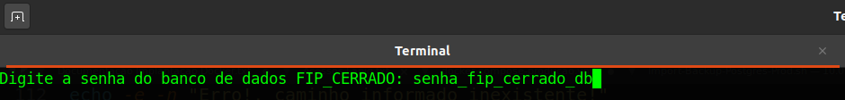
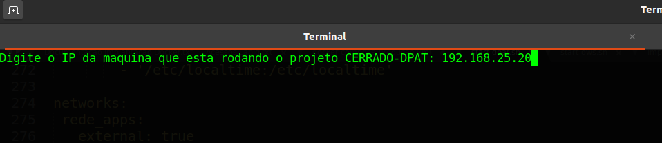

# Introdução

Conforme detalhado na seção [Arquitetura de Software](/02-arq_geral), para execução do Cerrado DPAT são necessárias 3 estruturas criadas e funcionais na máquina do usuário:

1. O Banco de Dados `fip_cerrado` restaurado no serviço do PostgreSQL devidamente instalado com a extensão PostGis.

2. O serviço *OWS Server* devidamente configurado e executando em um IP e porta.

3. O *Application Server* e client (Front-end) da aplicação compilados e executando.


## Restaurando e disponibilizando o banco de dados FIP-Cerrado

Para restaurar o banco `fip_cerrado` no PostgreSQL, é necessário ter o serviço PostgreSQL executando na máquina do usuário. Para tal, pode-se utilizar o tutorial neste [link](https://medium.com/@thiago.reis/instalando-e-configurando-postgresql-no-ubuntu-86716cda5894) para instalar e executar o PostgreSQL e o PGAdmin3.

Ao final do tutorial, deve-se verificar qual a versão do PostgreSQL instalado (ver: [link](https://phoenixnap.com/kb/check-postgresql-version)) e também instalar a extensão do Postgis para a versão adequada de acordo com o tutorial deste [link](https://computingforgeeks.com/how-to-install-postgis-on-ubuntu-debian/) no **Step 4: Install PostGIS on Ubuntu 20.04/18.04 / Debian 10**.

Com o PostgreSQL e o PostGIS instalados, em seguida é necessário realizar o download do último backup disponibilizado no [endereço](https://drive.google.com/file/d/19nVhry3bvHpV_oY861saBV9prXpfnFtd/view?usp=sharing) e extraí-lo.

``` sh
$ tar -xfv BKP_BANCO_DADOS_FIP_CERRADO.tar.gz
```

Em seguida, deve-se exportar a variável de senha do banco de dados configurada anteriormente.

``` sh
$ export PGPASSWORD= <db_password>
```

Após exportação da senha, deve criar o banco de dados no serviço PostgreSQL. Este passo pode ser realizado por linha de comando ou com ajuda do PGAdmin3. Ambos os passos estão demonstrados abaixo.

``` sh
$ psql -h <host_address> -U <db_user> -c "create database fip_cerado;"
```



Após a criação do banco de dados, deve-se criar as extensões do PostGis e PlPGSql para uso das funções na aplicação.

``` sh
$ psql -h <host_address> -U <db_user> -d fip_cerrado -c "create extension postgis;"

$ psql -h <host_address> -U <db_user> -d fip_cerrado -c "create extension plpgsql;"
```

Agora de fato pode-se restaurar o banco de dados baixado e extraído para a database `fip_cerrado` criada, o que pode ser alcançada através do comando.

``` sh
$ pg_restore -U fip_cerrado -h <host_address> -v -j 24 --format=d -C -d fip_cerrado fip_cerrado.sql/
```

Por fim, com o banco restaurado, deve-se criar/executar algumas funções auxiliares SQL para criação das [Materialized Views](https://www.postgresqltutorial.com/postgresql-materialized-views/) e algumas funções SQL customizadas para o Cerrado DPAT. Para tal, deve-se acessar o [arquivo .sql](https://github.com/lapig-ufg/d-pat/blob/master/src/server/scripts/bd_funcoes/ImportantFunctions.sql) e executá-lo da seguinte forma:

``` sh
$ psql -h <host_address> -U <db_user> -d fip_cerrado -a -f <ImportantFunctions.sql>
```


## Deployment do OWS Server

A fim facilitar/automatizar todo o processo de execução do OWS Server foi criado um script que executa todos os passos necessários. Este script deverá executar as seguintes tarefas:

* Download do contâiner do OWS Server presente no [endereço](https://drive.google.com/file/d/11WLTneFgdKC4Cb31TludwAZ-6jd4YkrG/view?usp=sharing)
* Cria a estrutura de pastas necessárias (ows-cache, catalog e dpat-files) para funcionamento do OWS Server.
* Constrói a aplicação do OWS Server e a disponibiliza em um IP e porta.

Conforme mencionado anteriormente, a estrutura do OWS Server foi construída com o apoio do [Docker](https://www.docker.com/), portanto para instalação do mesmo, deve-se seguir os passos definidos nos tutoriais de acordo com o sistema operacional, seja ele [Debian](https://docs.docker.com/engine/install/debian/) ou [CentOS](https://docs.docker.com/engine/install/centos/). Além do Docker, o script também faz uso das seguintes dependências:

| Dependência | Tutorial para Instalação |
| :------: | ---- |
| Perl | [https://learn.perl.org/installing/unix_linux.html](https://learn.perl.org/installing/unix_linux.html) |
| wget | [https://www.cyberciti.biz/faq/how-to-install-wget-togetrid-of-error-bash-wget-command-not-found/](https://www.cyberciti.biz/faq/how-to-install-wget-togetrid-of-error-bash-wget-command-not-found/) |
| curl | [https://www.cyberciti.biz/faq/how-to-install-curl-command-on-a-ubuntu-linux/](https://www.cyberciti.biz/faq/how-to-install-curl-command-on-a-ubuntu-linux/) |
| Git | [https://gist.github.com/derhuerst/1b15ff4652a867391f03](https://gist.github.com/derhuerst/1b15ff4652a867391f03) |


Após instalação do Docker e das dependências mínimas para o script, deve-se executar o script [`start-ows.sh`](https://drive.google.com/file/d/1dPdvaUiVkGHB_sz4dWifuj5z8bUH-PT_/view?usp=sharing) através do comando:

``` sh
$ ./start-ows.sh
```

Inicialmente o script irá pedir ao usuário que informe o local onde o OWS deverá criar a estrutura de pastas necessárias para funcionamento. Na imagem abaixo, o usuário terá informado o caminho `/mnt/hd02`. É importante ressaltar que este deverá ser um caminho válido na máquina do usuário, porém, como o OWS Server está armazenado em um contâiner Docker, o script irá mapear automaticamente este caminho para `/STORAGE` dentro da estrutura do Docker.



Em seguida, deve-se informar o diretório onde o cache deverá ser armazenado. Na imagem abaixo, o usuário terá informado novamente o caminho `/mnt/hd02`.


Em seguida, o script irá pedir para que o usuário informe o host (endereço) de onde está rodando o serviço do Banco de dados PostgreSQL, bem como, a porta de execução, o nome do banco de dados e a senha do banco. Estes dados são necessários para configurar o acesso do Mapserver ao banco de dados a fim de criar as camadas de dados vetoriais.






Após a inicialização do das variáveis necessárias para conectar o OWS Server com o banco de dados, o script irá realizar automaticamente o download do contâiner do OWS Server e importá-lo corretamente no Docker instalado na máquina do usuário.


Após a importação correta do contâiner, o OWS Server deverá estar executando e aguardando requisições em **localhost** ou **127.0.0.1** na **porta 5000**. A imagem abaixo apresenta um exemplo de requsição feita através do *curl* no endereço `http://127.0.0.1:5000/ows`, que recebe uma pequena página HTML criada pelo MapServer.


Após a execução do OWS Server, também é necessário mover os arquivos Raster presentes no [link](https://drive.google.com/file/d/1L2pW2PudSsmwGQMhPGXbZd5sJvBmEcSW/view?usp=sharing) para dentro da pasta `catalog` criada no caminho informado pelo usuário no início do script.

Por fim, vale ressaltar que uma vez que o contâiner do OWS Server esteja configurado e funcionando não é mais necessário executar o script `start-ows.sh`. Já existe um script na raiz do contâiner que é responsável por executar o OWS Server imediatamente após o contâiner ser inicializado. Portanto, basta executar:

``` sh
$ docker restart OWS bash
```

E caso deseja entrar no contâiner e verificar os arquivos internos, tais como **logs** de requisições, basta executar:

``` sh
$ docker exec -it OWS bash
$ cd /APP/lapig-maps/src/ows/log
$ tail -f ows-mapserv.log
```

## Deployment da aplicação Cerrado DPAT

Para execução do Cerrado DPAT é importante ressaltar que o Banco de Dados deve estar restaurado e acessível conforme abordado na [seção](/02-arq_execucao_dpat/#restaurando-e-disponibilizando-o-banco-de-dados-fip-cerrado) e também deve-se ter o [OWS Server](/02-arq_execucao_dpat/#execucao-do-ows-server) funcionando corretamente.

A seguir será abordado duas maneiras de executar a aplicação Cerrado DPAT em ambientes de Desenvolvimento e Produção. Para o ambiente de desenvolvimento será detalhado um passo a passo partindo do pressuposto que um programador irá dar manutenção ou continuidade no Cerrado DPAT. Já o ambiente de produção, será disponibilizado um script que executa todos os passos para disponibilizar o Cerrado DPAT em uma porta da máquina que está sendo executado. 

Em seguida, certifique-se de criar corretamente um arquivo `.env` conforme abordado na [seção](02-arq_servidor_de_aplicacao.md/#servidor-de-aplicacao). Um exemplo de arquivo `.env` criado durante o processo de execução do script para o ambiente de Produção pode ser observado abaixo:

```
APP_PRODUCAO='/STORAGE/dpat-files'
CLIENT_DIR='/../client/dist/lapig-dpat/'
LANG_DIR='/lang'
LOG_DIR='/log/'
TMP='/tmp/'
FIELD_DATA_DIR='/campo-dpat/'
UPLOAD_DATA_DIR='/upload-dpat/'
DOWNLOAD_DATA_DIR='/download-dpat/'

PG_USER='db_user'
PG_HOST='127.0.0.1'
PG_DATABASE='fip_cerrado'
PG_PASSWORD='db_password'
PG_PORT='db_port'
PG_DEBUG=true

PORT=3000
OWS_HOST='http://172.18.0.8:5000'
OWS_DOMAINS='http://172.18.0.8:5000'
NDVI_DOMAIN='127.0.0.1:4200'
```

### Ambiente de Desenvolvimento

Assim como abordado na [seção](/02-arq_geral/#arquitetura-de-software), o Cerrado DPAT foi construído com NodeJS como *Application Server* e Angular como cliente (*WebMap Client*). Portanto, primeiramente é necessária a instalação destes componentes na máquina do desenvolvedor. Para tal, pode-se seguir o passo-a-passo elaborado neste [link](https://www.tecmint.com/install-angular-cli-on-linux/)

Para execução do Cerrado DPAT em ambiente de desenvolvimento, primeiramente é necessário realizar um [`fork`](https://github.com/UNIVALI-LITE/Portugol-Studio/wiki/Fazendo-um-Fork-do-reposit%C3%B3rio) do projeto para a sua conta pessoal do Github e em seguida executar um [`git clone`](https://docs.github.com/pt/free-pro-team@latest/github/creating-cloning-and-archiving-repositories/cloning-a-repository) do [repositório do projeto](https://github.com/lapig-ufg/d-pat).

Para inicializar o servidor de aplicação (*Application Server*) deve-se executar o passo-a-passo descrito na [seção](/02-arq_servidor_de_aplicacao/#servidor-de-aplicacao). A execução da mesma irá inicializar o *Application Server* em localhost na porta 3000. Para verificar o seu funcionamento, pode-se realizar a requisição abaixo em um navegador qualquer, que deverá apresentar um resultado semelhante a [este](https://cerradodpat.ufg.br/service/deforestation/largest?year=2019&amount=15).

```
http://localhost:3000/service/deforestation/largest?year=2019&amount=15
```

Em seguida, para inicializar o *WebMap Client* localizado na pasta [`src/client`](https://github.com/lapig-ufg/d-pat/tree/master/src/client), basta navegar até a pasta **client** e instalar as dependências listadas no **package.json** através do comando:

```
$ npm install
```

Após a devida instalação das dependências, pode-se então compilar e inicializar a aplicação. Mais uma vez, a fim de facilitar, foi criado um script [`start.sh`](https://github.com/lapig-ufg/d-pat/blob/master/src/client/start.sh) para inicializar o *WebMap Client*, portanto basta executar:

```
$ ./src/client/start.sh
```

Ao finalizar a compilação do projeto, a aplicação estará executando em localhost na porta padrão do Angular, que é a porta 4200. Portanto, para acessar a página Web criada pela aplicação, acesse pelo navegador:

```
http://localhost:4200
```

### Ambiente de Produção

Em seguida, uma segunda maneira de disponibilizar o Cerrado DPAT é em ambiente de produção. É importante ressaltar que o *OWS Server* deve estar executando para que o Cerrado DPAT faça as requisições de imagens das diferentes camadas utilizadas pelo sistema.

Para facilitar o processo de *deployment* em produção, foi criado um [script](https://drive.google.com/file/d/1JFpmJtAHU37jYrBeAJ8BEjmiEeuSn7XQ/view?usp=sharing) que realiza todos os passos necessários para execução do Cerrado DPAT em produção. Para executar o script basta executar em um Terminal:

``` sh
$ ./start-dpat.sh
```

Assim como detalhado na seção de [Deployment do OWS Server](/02-arq_execucao_dpat/#execucao-do-ows-server), este script irá pedir ao usuário que informe os parâmetros **endereço, nome, porta, usuário e senha** do Banco de Dados, de forma a alterar corretamente o arquivo de configuração do ambiente, `.env` corretamente.

Em seguida, após pedir as informações do Banco de Dados, o script irá pedir ao usário que informe o local onde a estrutura de pastas do Cerrado DPAT deverá ser criada e também qual o endereço de IP da máquina de produção onde será realizado o *deployment* assim como informado nas imagens abaixo.




Basicamente o script deverá criar e ajustar automaticamente as variáveis de ambiente do Cerrado DPAT, realizar o download e importação do [contâiner docker](https://drive.google.com/file/d/1QKiBeo9II2auQik1jJdBACnHp4qrfc0f/view?usp=sharing) onde todas as dependências do projeto já estão devidamente ajustadas e executar os passos necessários para compilar e disponibilizar a aplicação no endereço de IP informado na execução do script na **porta 3000**, assim como apresentado na imagem abaixo.

## Script completo com execução completa para Produção

Por fim, também foi criado um [script](https://drive.google.com/file/d/1V6jRqeOUpqApvpaARRRB_iiN7D3GlFAV/view?usp=sharing) que realiza todos os passos abordados nas seções [Deployment do OWS Server](/02-arq_execucao_dpat/#execucao-do-ows-server) e [Deployment do Cerrado DPAT](/02-arq_execucao_dpat/#execucao-da-aplicacao-cerrado-dpat). Para tal, basta executar em Terminal.

``` sh
$ ./start-dpat+ows.sh
```

Após execução dos scripts o OWS Server estará executando na máquina do usuário na porta **5000** e o Cerrado DPAT também na máquina do usuário na porta **3000**.
