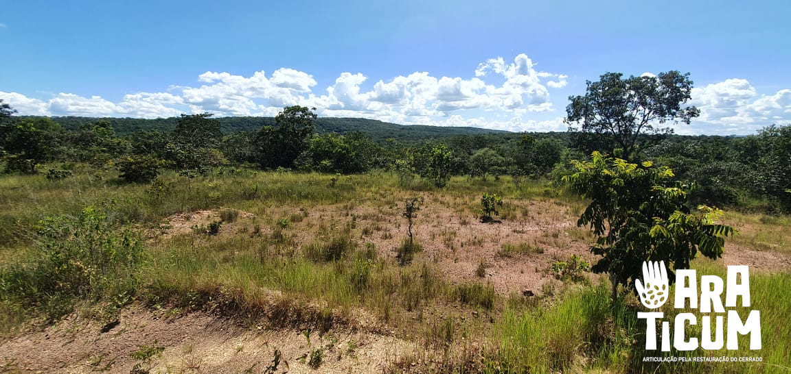

# Documentação da  Plataforma da Rede de Articulação pela Restauração do Cerrado

A Plataforma da Rede de Articulação pela Restauração do Cerrado (Araticum) é uma ferramenta online criada com o propósito de divulgar os dados referentes às áreas de Restauração da Rede Araticum, que é apoiado pela WWF-Brasil, junto às instituições como o Pacto pela Restauração da Mata Atlântica, Aliança pela Restauração da Amazônia e muitas outras, têm como objetivo acelerar a restauração nos principais biomas do país. Até 2030, o objetivo da instituição é chegar na marca de 12 milhões de hectares estejam restaurados ou em restauração com vegetação nativa, incluindo ecossistemas aquáticos. Desta forma,  ``O caminho é fazer as instituições conversarem e fortalecer quem está na ponta'', aponta Thiago Belote, especialista em restauração do WWF-Brasil [link para notícia](https://www.p22on.com.br/2021/06/01/conexoes-em-rede/).

Essa é a documentação técnica para a plataforma [Araticum](https://araticum.lapig.iesa.ufg.br/), desenvolvida pelo [Laboratório de Processamento de Images e Geoprocessamento da Universidade Federal de Goiás (LAPIG/UFG)](http://www.lapig.iesa.ufg.br) no âmbito da [Rede Araticum] (https://www.instagram.com/rede.araticum/) financiado pelo WWF-Brasil.
