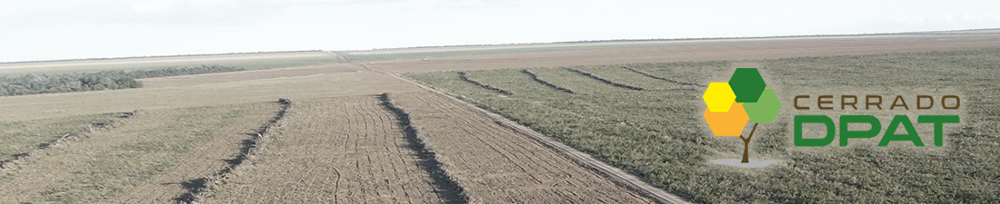

# Documentação Plataforma da Rede de Articulação pela Restauração do Cerrado

O Cerrado Deforestation Polygon Assessment Tool (Cerrado DPAT) é uma ferramenta online e gratuita criada com o propósito de caracterizar as áreas desmatadas detectadas pelos sistemas PRODES-Cerrado e DETER-Cerrado. Atualmente é utilizada por gestores, pesquisadores e todos aqueles que necessitam de informações sobre o bioma, especialmente sobre as características do desmatamento e áreas naturais susceptíveis a este tipo de evento.

Essa é uma documentação para a plataforma [Cerrado DPAT](http://cerradodpat.ufg.br), desenvolvida pelo [Laboratório de Processamento de Images e Geoprocessamento da Universidade Federal de Goiás (LAPIG/UFG)](http://www.lapig.iesa.ufg.br) no âmbito do [projeto Desenvolvimento de sistemas de prevenção de incêndios florestais e monitoramento da cobertura vegetal no Cerrado brasileiro](http://fip.mma.gov.br/projeto-fm/) financiado pelo Banco Mundial.

